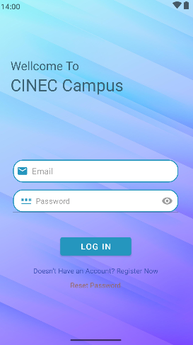
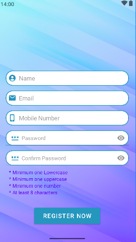
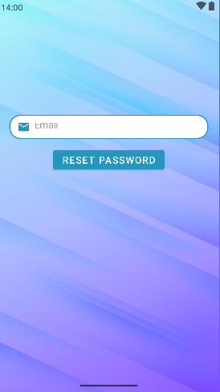
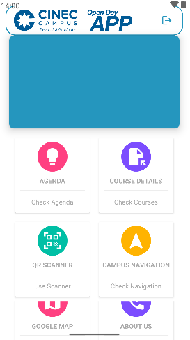
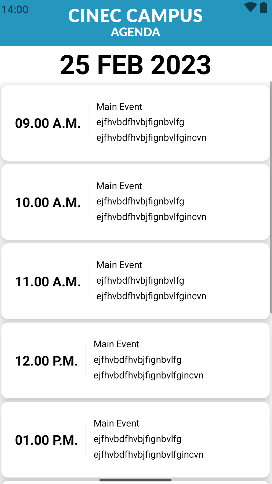
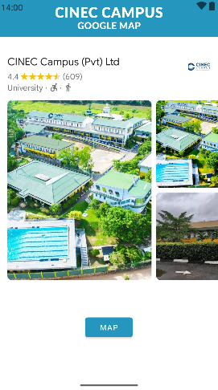
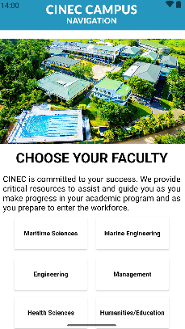
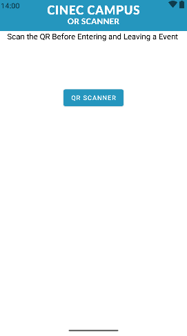
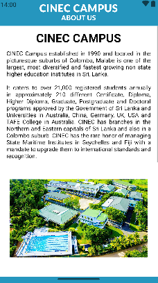

# *******Open Day Companion App*******

## Overview
This project is an Android application developed to assist students and visitors in navigating through the campus, accessing essential information about faculties, courses, upcoming events, and campus facilities. The application integrates several features aimed at enhancing the user experience, including real-time Google Maps integration, QR code scanning for event check-ins, and a comprehensive faculty navigation system. It’s designed to be intuitive, visually appealing, and highly functional, offering a seamless interface for interacting with various campus resources.

## Screenshots

### Mainpages

   
   
   
   
   
   
   
   
   
   

## Features

1. **User Authentication**:
   - **Login and Registration**: The application includes secure user authentication with email verification. Users can register by providing basic details such as name, email, phone number, and password. Passwords are securely handled with input validation for strength.
   - **Reset Password**: Users can reset their password using their registered email. This feature is included to enhance user security and convenience.

2. **Google Maps Integration**:
   - **Campus Map**: The app integrates Google Maps to provide real-time navigation assistance. Students and visitors can easily locate different facilities, departments, and services within the campus.
   - **Navigation Assistance**: Using the map, users can select specific locations and receive directions, making it easier to find classrooms, administrative buildings, and event venues.

3. **QR Code Scanner**:
   - **Event Check-ins**: The app allows users to scan QR codes at event venues for easy and quick check-ins. This feature helps in managing attendance for events such as seminars, workshops, and meetings.

4. **Faculty and Course Information**:
   - **Faculty Overview**: The app provides detailed information about the various faculties within the campus. This includes details about departments such as Maritime Sciences, Marine Engineering, Engineering & Technology, Management, Health Sciences, and Humanities.
   - **Courses**: Users can browse a wide array of courses offered by the university, categorized by faculty. Each course comes with a brief description to help students make informed decisions about their education path.

5. **Agenda and Event Management**:
   - **Event Listings**: Users can view and manage upcoming university events, including lectures, conferences, and extracurricular activities. Each event entry contains the date, time, venue, and a description of the event.
   - **Reminder System**: The app features a built-in reminder system that notifies users of upcoming events, ensuring they don’t miss any important dates.

6. **Contact Information**:
   - **Contact Us Page**: The app provides essential contact information for the university, including email addresses, phone numbers, and physical address. It also links to social media accounts for easy access to the university’s online presence.

7. **User Interface**:
   - **Responsive Design**: The app is designed with a responsive and user-friendly interface. It employs Material Design principles, offering a clean and modern look that enhances usability. The navigation is intuitive, and the design is consistent across all devices.

## Technologies Used

- **Java**: The core logic of the application is written in Java, following object-oriented principles to ensure maintainable and scalable code.
- **XML**: Used for designing the user interface, the XML layouts provide a structured and clean look, ensuring a smooth user experience.
- **Google Maps API**: Integrated to provide real-time navigation and map functionalities.
- **QR Code Scanning**: Implemented using a third-party library for efficient QR code recognition and processing.
- **Material Design**: The app uses Material Design components to create an intuitive and visually pleasing interface.
- **SQLite**: Integrated for local storage to manage user data, event information, and other app-specific data that can be accessed offline.
- **Firebase Authentication**: Used for secure user login, registration, and password reset functionalities.

## Project Structure

- **Activities**: Each major feature of the app (e.g., login, registration, event check-ins, faculty navigation) is managed by a corresponding activity in the app. Activities handle the UI and user interactions for their respective features.
- **Fragments**: The application employs fragments for modular UI development, enabling smoother transitions between sections such as faculty navigation, course details, and the map view.
- **Models**: The app uses model classes to define data structures, including user profiles, event details, and course information.
- **Services**: Background services handle reminders and notifications, ensuring the app runs efficiently without interrupting the user’s experience.

## Installation

To run this project locally:
1. Clone the repository from GitHub.
2. Open the project in Android Studio.
3. Sync the project with Gradle to download dependencies.
4. Obtain a Google Maps API key and insert it into the google_maps_api.xml file.
5. Configure Firebase for user authentication by setting up your project in the Firebase Console and adding the google-services.json file to the app directory.
6. Build and run the application on an Android device or emulator.

## Future Enhancements

- **Push Notifications**: Implement push notifications for real-time event updates.
- **Social Media Integration**: Allow users to share events and faculty information on social media platforms directly from the app.
- **Feedback System**: Add a feedback feature to gather input from users for continuous improvement.
- **Enhanced User Profiles**: Extend user profiles to include academic progress, schedule management, and personalized course recommendations.

## Group Members
______________

| Index   | Name                         |
|---------|------------------------------|
| 2064801 | H.M.Laviru Githmal Herath     |
| 2220488 | A.A.D.Chaniru Puldith         |
| 2065716 | N.Andrea Okeena Carmel        |
| 2221632 | Mewan Dimalsha Weeraman       |
| 2064867 | S.Sandika Sathsara            |
| 2064863 | Sachini Chathurika            |
| 2211734 | R.S.P.Sathsarani              |
